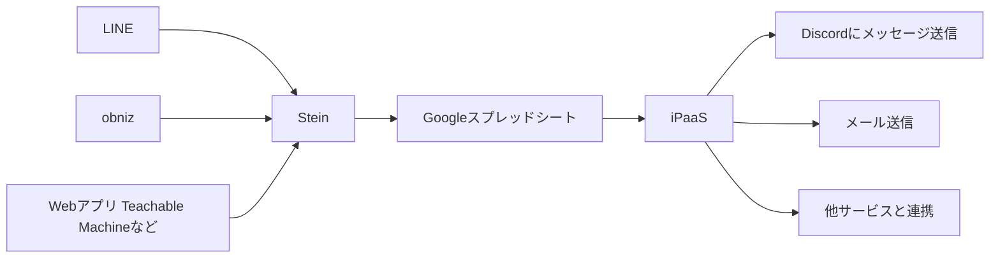

# 応用: Googleスプレッドシートを接着剤に、LINE Botとツールをつなげる・obnizとツールをつなげる

[stein-js-client](https://github.com/SteinHQ/JS-Client)という、JavaScriptでGoogleスプレッドシートを簡単に操作できるライブラリが公開されています。
  - [JSクライアントも完備！GoogleスプレッドシートでAPIが作れる「Stein」 - ITnews](https://itnews.org/news_contents/product-stein)

LINE Botやobnizから、Googleスプレッドシートにデータを書き込む。その更新をiPaaSで検知して、後続の処理を実行する。  
という風に、Googleスプレッドシートを接着剤として、LINE Botやobniz、WebアプリとiPaaSを繋ぎ、制作の幅を広げることができるようになります。



本章では、LINE BotとobnizからGoogleスプレッドシートにデータを書き込む方法を紹介します。

## 1. 事前準備

### 1-1. SteinにGoogleスプレッドシートを登録し、API URLを発行する

こちらの記事を参考に、`API URL`を発行しましょう。<br>
あとで利用しますので、メモ帳などにコピペしておいてください。

- [【簡単DB】Steinで超絶簡単にgoogle spreadsheetをDB化してみよう！ - Qiita](https://qiita.com/masuraoProg/items/efaa6397d2d5409c968b)

GoogleスプレッドシートのA1にヘッダーとして`Message`と入力しておきましょう。

[](https://i.gyazo.com/235397a3153d9e905dee003e47329978.png)

### 1-2. LINE Botのチャネルシークレットとチャネルアクセストークンを発行する

[LINE公式アカウントの作成 / LINE Botの初め方](https://zenn.dev/protoout/articles/16-line-bot-setup) を参考に、`チャネルシークレット`と`チャネルアクセストークン`を発行しましょう。<br>
あとで利用しますので、メモ帳などにコピペしておいてください。

### 1-3. obnizとパーツを準備する

下記のパーツを手元に用意してください。


- obniz Board
- 温度センサー

## 2. LINE BotからGoogleスプレッドシートにデータを書き込む

[](https://i.gyazo.com/78d5a4d4afebcec14461b38e95b9522f.gif)

- おうむ返しを行うLINE Botを作成します。
  - [1時間でLINE BOTを作るハンズオン (資料+レポート) in Node学園祭2017 #nodefest - Qiita](https://qiita.com/n0bisuke/items/ceaa09ef8898bee8369d)
- Steinライブラリをインストールします。
  - `npm i stein-js-client`
- 以下のプログラムを`server.js`にコピペします。
  - SteinのAPI URL、チャネルシークレット、アクセストークンを埋めてください。
  - <details>

    <summary>LINE Bot + Steinのサンプルコード</summary>

    ```js
    'use strict';

    const express = require('express');
    const line = require('@line/bot-sdk');

    // Steinを利用するための準備
    const SteinStore = require('stein-js-client');
    const store = new SteinStore('SteinのAPI URLを記載する');

    const PORT = process.env.PORT || 3000;

    // Messaging APIを利用するための鍵を設定します。
    const config = {
      channelSecret: 'チャネルシークレット',
      channelAccessToken: 'チャネルアクセストークン'
    };

    const client = new line.Client(config);

    async function handleEvent(event) {
      if (event.type !== 'message' || event.message.type !== 'text') {
        return Promise.resolve(null);
      }

      // シート名`シート1`の`Message`列に、LINE Botに送信したメッセージを書き込む。
      await store.append("シート1", [
        {
          Message: event.message.text,
        }
      ]);

      // ユーザーにリプライメッセージを送ります。
      return client.replyMessage(event.replyToken, {
        type: 'text', // テキストメッセージ
        text: event.message.text // ← ここに入れた言葉が実際に返信されます
        // event.message.text には、受信したメッセージが入っているので、それをそのまま返信しています
        // ここを 'テスト' のように書き換えると、何を受信しても「テスト」と返すようになります
      });
    }

    // ここ以降は理解しなくてOKです
    const app = express();
    app.get('/', (req, res) => res.send('Hello LINE BOT! (HTTP GET)'));
    app.post('/webhook', line.middleware(config), (req, res) => {

      if (req.body.events.length === 0) {
        res.send('Hello LINE BOT! (HTTP POST)');
        console.log('検証イベントを受信しました！');
        return;
      } else {
        console.log('受信しました:', req.body.events);
      }

      Promise.all(req.body.events.map(handleEvent)).then((result) => res.json(result));
    });

    app.listen(PORT);
    console.log(`ポート${PORT}番でExpressサーバーを実行中です…`);
    ```
    </details>
- いつも通りLINE Botを起動します。
  - `node server.js`、`ngrok http 3000`、Webhook URLの更新
- LINE Botに送信したメッセージが、Googleスプレッドシートに記載されていくことを確認しましょう。

### 3. obnizからGoogleスプレッドシートにデータを書き込む

[](https://gyazo.com/2bd2fc17ad96d75117095b47fc730c18)

obnizのプログラムでもSteinを利用することで、Googleスプレッドシートにセンサーの値などを書き込むことができます。  
例として、obnizと温度センサーで温度を測ってスプレッドシートに記入してみます。

#### パーツ接続

obnizと温度センサー（LM60）を0~2番ピンに接続します。<br>
温度センサーの平らな面がこちらを向くようにします。（:warning:逆向き注意。ヤケドする可能性があります:warning:）


#### プログラム

```javascript
const Obniz = require("obniz");
const SteinStore = require('stein-js-client');

// obnizを利用するための準備
const obniz = new Obniz("OBNIZ IDをここに記入する");
// Steinを利用するための準備
const store = new SteinStore("事前準備1-1で取得したAPI URLをここに記入する");

obniz.onconnect = async function () {
  for (let i = 0; i < 10; i++) {
    // 温度を取得する
    const lm60 = obniz.wired("LM60", { gnd:0 , output:1, vcc:2});
    const temperature = await lm60.getWait();
    
    // シート名`シート1`の`Message`列に書き込む。
    await store.append("シート1", [
      {
        Message: '温度は' + temperature + '℃だよ！',
      }
    ]);

    // 5秒待つ
    await obniz.wait(5000);
  }
}
```

#### 動作イメージ

プログラムを実行すると5秒ごとにスプレッドシートへ温度が記入されます。

[](https://gyazo.com/2bd2fc17ad96d75117095b47fc730c18)

## 目次へ

一度[トップページ](./)に戻って次の資料へ
